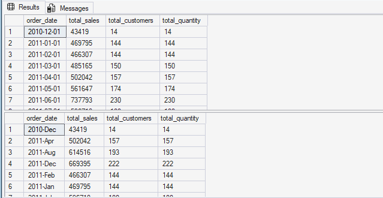
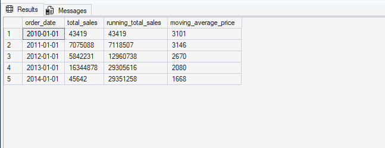
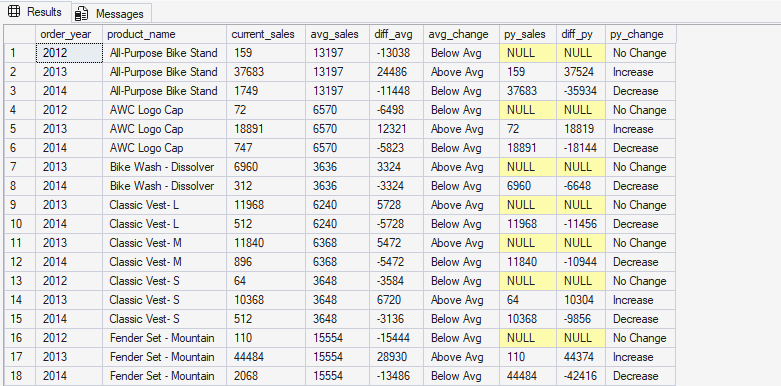
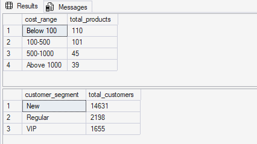
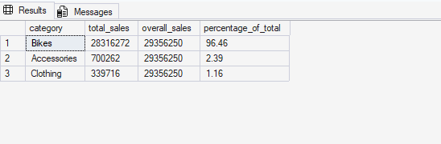
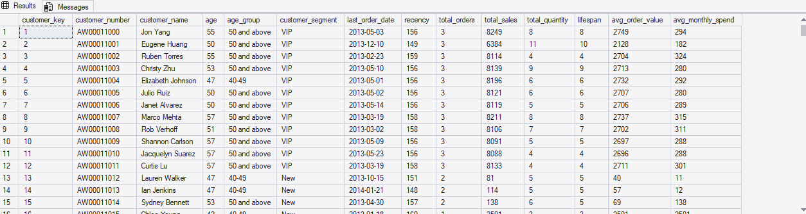
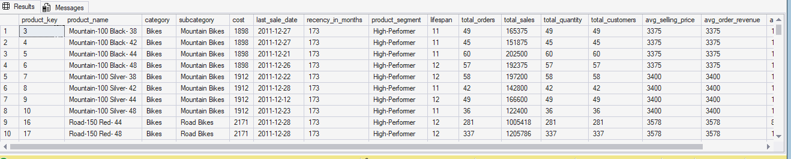

# E-Commerce Sales Analytics: Performance, Customer Segments & Strategic Reporting
### Advanced SQL Analytics — Part 2

---

## Abstract

Numbers don't explain themselves. Knowing total revenue was $29.4M is useful, sure — but it doesn't tell you *why* June outperformed every other month, or why a handful of customers seem to account for a wildly disproportionate chunk of that figure, or why some products just keep declining no matter what.

That's what this project is about.

This is Part 2 of a two-part SQL analytics series on an e-commerce dataset. Part 1 handled the messy stuff — cleaning the data, setting up the Gold Layer tables, running exploratory analysis to get baseline numbers. This phase picks up from there and goes deeper: tracking trends over time, segmenting customers and products by actual behavior, figuring out which categories are carrying the business, and wrapping it all up in two SQL Views built for real, ongoing use.

Less "here are some numbers," more "here's what's actually going on."

---

## Section 1 — Introduction & Problem Statement

### 1.1 Background

Coming out of Part 1, the baselines were clear: **$29,356,250 in total revenue**, **27,659 orders**, **18,484 unique customers**. Good to know. But baseline numbers are just the starting point — they tell you where you are, not how you got there or where you're headed.

The next step was digging into the patterns underneath. How does revenue move month to month? Which products are actually growing vs. slowly dying? Are we acquiring new customers, retaining existing ones, or both? And most importantly — who are the customers actually driving revenue, and how are we treating them?

Those are the questions this project answers.

### 1.2 Problem Statement

Working with the same Gold Layer e-commerce dataset, the analysis tackles five core questions:

- How is sales volume shifting over time, and are there seasonal patterns consistent enough to plan around?
- What does the long-term revenue trajectory look like when you stack it cumulatively — and is average pricing going up or down?
- Which products are beating their own historical averages, and how do they compare to where they were a year ago?
- How are customers and products distributed when you group them by actual behavior rather than surface-level attributes?
- Which product categories are driving revenue, and by exactly how much?

### 1.3 Research Objectives

Six steps to get there:

1. Pull monthly sales trends and look for recurring seasonal demand patterns.
2. Build running totals and moving averages to track long-term revenue growth.
3. Use `LAG()` to benchmark each product's current year against its prior year performance.
4. Segment the customer base — VIP, Regular, New — based on spend and tenure.
5. Calculate each product category's exact percentage contribution to total revenue.
6. Package the whole thing into two reusable SQL Views for ongoing BI use.

---

## Section 2 — Methodology & Tools

### 2.1 Dataset

Same three Gold Layer tables from Part 1:

| File | Description |
|---|---|
| `gold.dim_customers.csv` | Customer demographic records |
| `gold.dim_products.csv` | Product catalog — categories, subcategories, costs |
| `gold.fact_sales.csv` | Transaction-level records — orders, quantities, sales amounts |

### 2.2 Analytical Approach

| Technique | What it does |
|---|---|
| Change Over Time Analysis | Tracks performance shifts across months and years |
| Cumulative Analysis | Builds lifetime running totals and moving average prices |
| Performance Analysis | Year-over-Year benchmarking with analytical functions |
| Data Segmentation | Groups customers and products into behavioral brackets |
| Part-to-Whole Analysis | Calculates each category's share of total revenue |
| Business Reporting | Packages insights into reusable SQL Views for BI connections |

### 2.3 Project Scripts

| Script | What it covers |
|---|---|
| `01_change_over_time_analysis.sql` | Monthly sales, order counts, active customer trends |
| `02_cumulative_analysis.sql` | Running revenue totals and pricing trajectory |
| `03_performance_analysis.sql` | YoY product benchmarking via `LAG()` |
| `04_data_segmentation.sql` | Customer tiers + product cost range grouping |
| `05_part_to_whole_analysis.sql` | Revenue breakdown by product category |
| `06_report_customers.sql` | Consolidated customer profile view |
| `07_report_products.sql` | Consolidated product performance view |

> 💡 All scripts are fully commented and stored in the [`/scripts`](./scripts/) folder. The snippets in this README show the core logic — not the full files.

### 2.4 Tools & SQL Techniques

- **SQL Server (T-SQL) & SSMS** — main query environment throughout
- **CTEs** — kept the complex joins and transformations readable and modular
- **Window Functions (`SUM OVER`, `AVG OVER`, `LAG`, `RANK`)** — running totals, moving averages, year-over-year comparisons without collapsing rows
- **`CASE WHEN`** — custom segmentation logic for both customer tiers and product cost brackets
- **`DATETRUNC`, `DATEPART`** — rolled daily transactions into monthly and annual aggregates
- **SQL Views** — saved the final queries as virtual tables so they can be queried directly from Power BI, Tableau, or wherever

---

## Section 3 — Analysis & Results

### 3.1 Change Over Time Analysis
📄 *Script: `01_change_over_time_analysis.sql`*

**Objective:** Look at how monthly sales volume, order counts, and active customers shift across the calendar — basically, figure out if there's a pattern to when the business does well and when it doesn't.

```sql
-- Tracking Monthly Sales Trends
SELECT
    DATETRUNC(month, order_date) AS order_date,
    SUM(sales_amount) AS total_sales,
    COUNT(DISTINCT customer_key) AS total_customers,
    SUM(quantity) AS total_quantity
FROM gold.fact_sales
WHERE order_date IS NOT NULL
GROUP BY DATETRUNC(month, order_date)
ORDER BY DATETRUNC(month, order_date);

-- Annual Sales Trend using FORMAT()
SELECT
    FORMAT(order_date, 'yyyy-MMM') AS order_date,
    SUM(sales_amount) AS total_sales,
    COUNT(DISTINCT customer_key) AS total_customers,
    SUM(quantity) AS total_quantity
FROM gold.fact_sales
WHERE order_date IS NOT NULL
GROUP BY FORMAT(order_date, 'yyyy-MMM')
ORDER BY FORMAT(order_date, 'yyyy-MMM');
```

**Result:**



**Findings:**

The dataset starts in December 2010 — small numbers, just **$43,419 in sales**, 14 customers, 14 units. Not a lot to work with. But January 2011 jumps straight to **$469,795** across **144 active customers**, which is a pretty sharp early ramp.

From there it keeps climbing through the first half of 2011, peaking in June at **$737,793 in revenue** with **230 active customers**.

The thing that stood out most: customer count and revenue move almost in lockstep. That's telling — it means volume changes are being driven by how many buyers are active in a given month, not by big swings in individual order size. Acquire more buyers in a month, revenue goes up. Simple, but important to confirm.

---

### 3.2 Cumulative Analysis
📄 *Script: `02_cumulative_analysis.sql`*

**Objective:** Build a running total to see revenue stacking up over time, and layer in a moving average price to catch any long-term pricing drift.

```sql
SELECT
    order_date,
    total_sales,
    SUM(total_sales) OVER (ORDER BY order_date) AS running_total_sales,
    AVG(avg_price) OVER (ORDER BY order_date) AS moving_average_price
FROM (
    SELECT
        DATETRUNC(year, order_date) AS order_date,
        SUM(sales_amount) AS total_sales,
        AVG(price) AS avg_price
    FROM gold.fact_sales
    WHERE order_date IS NOT NULL
    GROUP BY DATETRUNC(year, order_date)
) t;
```

**Result:**



**Findings:**

Revenue goes from **$43,419** (2010) to a cumulative **$29,351,258** by 2014. The growth is real and consistent — each year adds a meaningful chunk on top of the last.

The moving average price is the more interesting signal here, honestly. It drops from **$3,101** in 2010 down to **$1,668** by 2014 — a pretty steady decline. That's worth paying attention to. It could mean lower-priced products are gaining share, or that the customer mix is shifting toward buyers spending less per transaction. Either way, it's not a number to ignore.

---

### 3.3 Performance Analysis — Year-over-Year
📄 *Script: `03_performance_analysis.sql`*

**Objective:** Benchmark each product's annual sales against its own historical average and against its numbers from the prior year — so you can actually see which products are trending up, which are trending down, and which are just coasting.

```sql
WITH yearly_product_sales AS (
    SELECT
        YEAR(f.order_date) AS order_year,
        p.product_name,
        SUM(f.sales_amount) AS current_sales
    FROM gold.fact_sales f
    LEFT JOIN gold.dim_products p
        ON f.product_key = p.product_key
    WHERE f.order_date IS NOT NULL
    GROUP BY YEAR(f.order_date), p.product_name
)
SELECT
    order_year,
    product_name,
    current_sales,
    AVG(current_sales) OVER (PARTITION BY product_name) AS avg_sales,
    current_sales - AVG(current_sales) OVER (PARTITION BY product_name) AS diff_avg,
    CASE
        WHEN current_sales > AVG(current_sales) OVER (PARTITION BY product_name) THEN 'Above Avg'
        WHEN current_sales < AVG(current_sales) OVER (PARTITION BY product_name) THEN 'Below Avg'
        ELSE 'Avg'
    END AS avg_change,
    LAG(current_sales) OVER (PARTITION BY product_name ORDER BY order_year) AS py_sales,
    current_sales - LAG(current_sales) OVER (PARTITION BY product_name ORDER BY order_year) AS diff_py,
    CASE
        WHEN current_sales > LAG(current_sales) OVER (PARTITION BY product_name ORDER BY order_year) THEN 'Increase'
        WHEN current_sales < LAG(current_sales) OVER (PARTITION BY product_name ORDER BY order_year) THEN 'Decrease'
        ELSE 'No Change'
    END AS py_change
FROM yearly_product_sales
ORDER BY product_name, order_year;
```

**Result:**



**Findings:**

This one ended up being more useful than I expected, mostly because of how two signals work together.

The **Above Avg / Below Avg** flag shows how a product is doing relative to its own history. The **Increase / Decrease** flag shows whether it's improving or declining right now compared to last year. Cross those two and you get something actually actionable — four buckets that each tell a different story:

- **Above Avg + Increase** → consistently strong and still growing. These are your winners.
- **Below Avg + Increase** → underperforming historically but recovering. Worth watching.
- **Above Avg + Decrease** → has historically done well but slipping. Early warning sign.
- **Below Avg + Decrease** → chronic underperformers heading further down. These need a decision.

Most of the products in the dataset cluster toward the extremes — either clearly doing well or clearly not. Not a lot of ambiguous middle ground.

---

### 3.4 Data Segmentation
📄 *Script: `04_data_segmentation.sql`*

**Objective:** Split customers into VIP, Regular, and New groups based on how long they've been buying and how much they've spent. Do the same for products by cost range.

```sql
-- Product Cost Segmentation
WITH product_segments AS (
    SELECT
        product_key,
        product_name,
        cost,
        CASE
            WHEN cost < 100 THEN 'Below 100'
            WHEN cost BETWEEN 100 AND 500 THEN '100-500'
            WHEN cost BETWEEN 500 AND 1000 THEN '500-1000'
            ELSE 'Above 1000'
        END AS cost_range
    FROM gold.dim_products
)
SELECT
    cost_range,
    COUNT(product_key) AS total_products
FROM product_segments
GROUP BY cost_range
ORDER BY total_products DESC;

-- Customer Behavioral Segmentation
WITH customer_spending AS (
    SELECT
        c.customer_key,
        SUM(f.sales_amount) AS total_spending,
        DATEDIFF(month, MIN(order_date), MAX(order_date)) AS lifespan
    FROM gold.fact_sales f
    LEFT JOIN gold.dim_customers c ON f.customer_key = c.customer_key
    GROUP BY c.customer_key
)
SELECT
    customer_segment,
    COUNT(customer_key) AS total_customers
FROM (
    SELECT
        customer_key,
        CASE
            WHEN lifespan >= 12 AND total_spending > 5000 THEN 'VIP'
            WHEN lifespan >= 12 AND total_spending <= 5000 THEN 'Regular'
            ELSE 'New'
        END AS customer_segment
    FROM customer_spending
) AS segmented_customers
GROUP BY customer_segment
ORDER BY total_customers DESC;
```

**Result:**



**Findings:**

The customer breakdown: **14,631 New**, **2,198 Regular**, **1,655 VIP**.

That VIP number — 1,655 customers out of 18,484 total — is small. Less than 9% of the customer base. But customers with 12+ months of history and $5,000+ in total spend almost certainly account for a much bigger slice of that $29.4M than their headcount suggests. That gap between size and contribution is exactly the kind of thing that should drive retention decisions.

On the product side, most SKUs are either under $100 (110 products) or in the $100–$500 range (101 products). The higher-cost tiers are smaller — 45 products in the $500–$1,000 range and 39 above $1,000. Those high-cost products don't need to move many units to matter; they need different inventory logic and different margin expectations than the bulk of the catalog.

---

### 3.5 Part-to-Whole Analysis
📄 *Script: `05_part_to_whole_analysis.sql`*

**Objective:** Calculate exactly what share of total revenue each product category is responsible for.

```sql
WITH category_sales AS (
    SELECT
        p.category,
        SUM(f.sales_amount) AS total_sales
    FROM gold.fact_sales f
    LEFT JOIN gold.dim_products p ON p.product_key = f.product_key
    GROUP BY p.category
)
SELECT
    category,
    total_sales,
    SUM(total_sales) OVER () AS overall_sales,
    ROUND((CAST(total_sales AS FLOAT) / SUM(total_sales) OVER ()) * 100, 2) AS percentage_of_total
FROM category_sales
ORDER BY total_sales DESC;
```

**Result:**



**Findings:**

Bikes: **96.46%** of total revenue. $28,316,272 out of $29,356,250.

Accessories: **2.39%**. Clothing: **1.16%**.

Part 1 hinted at this concentration — this query just made the number exact. Nearly all of this business's revenue lives in one category. That's not inherently a problem, but it does mean that anything that disrupts bike sales — supply issues, market shifts, new competition — hits the entire business almost immediately. There's very little buffer.

---

### 3.6 Production Reports — SQL Views
📄 *Scripts: `06_report_customers.sql`, `07_report_products.sql`*

**Objective:** Take all the metrics built across the previous analyses and consolidate them into two SQL Views — one for customers, one for products — that can be queried directly without rebuilding anything.

**Customer Report View (`gold.report_customers`):**

```sql
CASE
    WHEN lifespan >= 12 AND total_sales > 5000 THEN 'VIP'
    WHEN lifespan >= 12 AND total_sales <= 5000 THEN 'Regular'
    ELSE 'New'
END AS customer_segment,
CASE
    WHEN age < 20 THEN 'Under 20'
    WHEN age BETWEEN 20 AND 29 THEN '20-29'
    WHEN age BETWEEN 30 AND 39 THEN '30-39'
    WHEN age BETWEEN 40 AND 49 THEN '40-49'
    ELSE '50 and above'
END AS age_group,
CASE WHEN total_sales = 0 THEN 0
     ELSE total_sales / total_orders
END AS avg_order_value,
CASE WHEN lifespan = 0 THEN total_sales
     ELSE total_sales / lifespan
END AS avg_monthly_spend
```

Each row in this view gives you: segment (VIP/Regular/New), age group, total orders, total sales, total quantity, products purchased, months since last order, Average Order Value, and Average Monthly Spend.

**Product Report View (`gold.report_products`):**

```sql
CASE
    WHEN total_sales > 50000 THEN 'High-Performer'
    WHEN total_sales >= 10000 THEN 'Mid-Range'
    ELSE 'Low-Performer'
END AS product_segment,
CASE
    WHEN total_orders = 0 THEN 0
    ELSE total_sales / total_orders
END AS avg_order_revenue,
CASE
    WHEN lifespan = 0 THEN total_sales
    ELSE total_sales / lifespan
END AS avg_monthly_revenue
```

Each row gives you: performance tier (High-Performer/Mid-Range/Low-Performer), total orders, total sales, total quantity, unique customers, months since last sale, Average Order Revenue, and Average Monthly Revenue.

**Customer Report Result:**



**Product Report Result:**



---

## Section 4 — Key Findings

- **Sales are seasonal and the pattern is consistent** — certain months reliably outperform others across the full 37-month range, which means there's enough signal here to actually plan around rather than just react to.

- **Revenue growth is real and cumulative** — the running total goes from $43K in late 2010 to $29.35M by end of 2014. Each year stacks meaningfully on the last.

- **Average transaction value is declining** — moving average price dropped from $3,101 in 2010 to $1,668 by 2014. Worth digging into whether that's a product mix issue or a customer mix issue.

- **Product performance is polarized** — the YoY analysis doesn't show much middle ground. Products are either consistently strong or consistently struggling, with relatively few in genuine transition.

- **1,655 VIP customers are probably carrying a huge share of $29.4M** — that's a small group to be this dependent on.

- **Bikes are 96.46% of revenue.** Accessories and Clothing are essentially rounding errors right now.

- **The Mountain-200 line shows up consistently as a top performer** — across multiple variants, it's Above Average and growing year over year.

- **Two production SQL Views are built and ready** — `report_customers` and `report_products` can be queried directly or connected to any BI tool without rebuilding the logic.

---

## Section 5 — Recommendations

**1. Protect the VIP customers — seriously**

1,655 VIP customers out of 18,484 total is a pretty concentrated revenue base. A dedicated retention effort — exclusive early access, personalized outreach, loyalty incentives — isn't just nice to have here. Losing even a portion of that group is a material revenue event, not just a churn stat.

**2. Make a call on the declining products**

The YoY analysis flags which products are consistently Below Average and still dropping. At some point "monitoring" isn't a strategy. Each of those products needs an actual decision: reprice it, reposition it, run a promotion, or pull it. Leaving underperformers in the catalog has real carrying costs — in inventory, in margin, and in the bandwidth it takes to manage them.

**3. Get ahead of the seasonal peaks**

The demand patterns are clear enough to plan around. Inventory builds and staffing decisions should be happening a few months before the peaks, not during them. The data already shows when those peaks tend to hit.

**4. Start building revenue outside Bikes**

96.46% in one category is a real concentration risk. It doesn't have to flip overnight — even getting Accessories and Clothing to a combined 10–15% of revenue would materially reduce the business's exposure to anything that disrupts bike sales. That's a longer-term play, but it starts with deciding to prioritize it.

**5. Connect the Views to a BI tool**

The `report_customers` and `report_products` views aren't one-off outputs. They're built to stay current and be queried repeatedly. Hooking them up to Power BI or Tableau would turn this project into an ongoing monitoring system rather than a static analysis. The SQL logic is done — the connection is the easy part.

---

## Section 6 — Conclusion

There's a version of this project that stops at "we made $29.4M across 27,659 orders." That version isn't very useful.

This one goes further. Five layers of SQL analysis — trends, cumulative growth, year-over-year performance, behavioral segmentation, and revenue share — on the same dataset, building toward a picture that's actually specific enough to act on.

What that picture shows: a business almost entirely dependent on one product category and one product line, sustained by a small group of high-value customers, with predictable seasonal patterns that aren't being fully leveraged, and a long tail of underperforming products that haven't been seriously reviewed.

The two SQL Views that wrap up the project are the most practically useful output. Not because they're technically impressive — because they mean the next analyst, manager, or BI dashboard doesn't have to rebuild any of this from scratch. The work is already done. Just connect and query.

That's the point of building analytics infrastructure instead of one-time reports.

---

## 📁 Project Structure

```
Advanced_SQL_Analytics/
├── datasets/
│   ├── gold.dim_customers.csv
│   ├── gold.dim_products.csv
│   └── gold.fact_sales.csv
├── scripts/
│   ├── 01_change_over_time_analysis.sql
│   ├── 02_cumulative_analysis.sql
│   ├── 03_performance_analysis.sql
│   ├── 04_data_segmentation.sql
│   ├── 05_part_to_whole_analysis.sql
│   ├── 06_report_customers.sql
│   └── 07_report_products.sql
├── images/
└── README.md
```

> 🔗 This is **Part 2** of a two-part SQL analytics series. For the foundational EDA and database setup, see [Part 1 — E-Commerce Sales EDA](https://github.com/DanielSampson/E-Commerce-Sales-EDA-Database-And-Business-Metrics-Exploration-Using-SQL)
